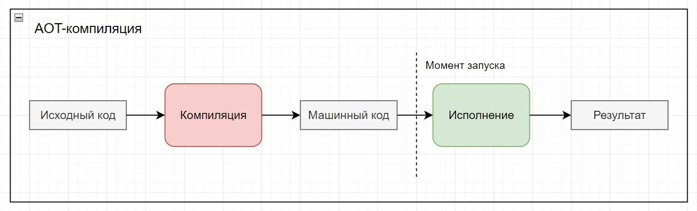
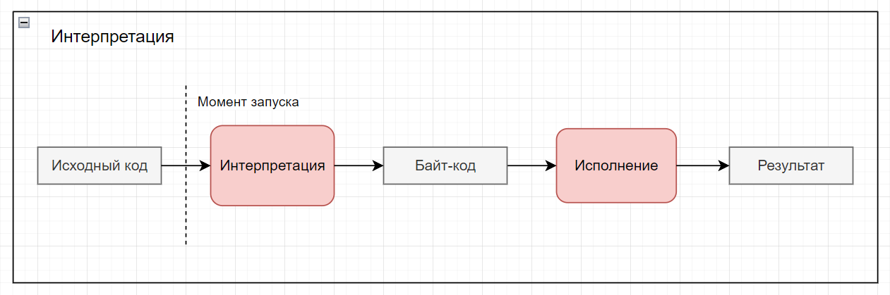
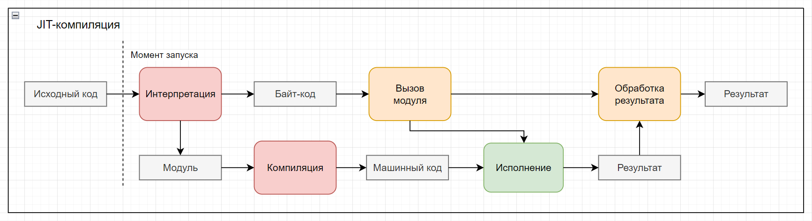

# Потенциал и особенности применения JIT-компиляции в Python

## Введение

Многим из читателей известно, что Python достаточно медленный язык. В сравнении с C++ принято называть замедление в
[20-30 раз](https://towardsdatascience.com/how-fast-is-c-compared-to-python-978f18f474c7). Объясняется это в основном
тем, что Python - интерпретируемый язык программирования.

Однако, целое сообщество программистов на питоне готовы "заплатить эту цену" ради удобства синтаксиса, быстроты
написания, изящности и выразительности кода (очевидно, что код будет казаться изящным только в представлении *человека*,
но не машины).

Здесь возникает задача оптимизации, когда хочется использовать удобный синтаксис и не так сильно проигрывать в
производительности. Существует множество разных подходов к этой задаче, среди которых стоит выделить JIT-компиляцию (
Just-In-Time) и AOT-компиляцию (Ahead-Of-Time), имеющих свои преимущества и недостатки.

В рамках этой статьи будет рассмотрен пример создания простого JIT-компилятора для языка Python
(как ни странно, на языке Python). Этот компилятор не претендует на роль промышленного решения (так как там уже
существуют
[свои игроки](https://numba.pydata.org/)), а скорее призван показать, с какими особенностями реализации может
столкнуться программист, при написании подобных инструментов для прикладных и исследовательских нужд.

## JIT-компиляция как метод оптимизации

Для понимания идеологии JIT-компиляции рассмотрим три основных метода обработки и исполнения кода.

### Компиляция до исполнения (AOT)

Самый древний подход, заключающийся в переводе программы на языке высокого уровня до машинного кода с последующим
исполнением. Отсюда и произошло выражение "Ahead Of Time" - перед моментом выполнения. Наглядно и достаточно алгоритм
компиляции формально показан на рисунке ниже.



Красным отмечен блок, занимающий много времени, зелёным - относительно мало.

Плюсы подхода:

* Самая высокая производительность выполнения, так как программа сразу запускается на уровне машинного кода
* Временные затраты вынесены в стадию компиляции, которой не замечает конечный пользователь

Минусы подхода:

* Под каждую новую архитектуру процессора необходимо выполнять компиляцию заново
* Код невозможно изменить во время выполнения

### Интерпретация

В рамках языка программирования высокого уровня реализуется "виртуальная машина", которая выполняет байт-код,
поступающий из обработки текста программы в режиме реального времени.



И интерпретация, и исполнение байт-кода занимают относительно много времени и ресурсов, поэтому оба блока помечены
красным.

Плюсы подхода:

* Интерактивность исполнения и максимальная гибкость настройки
* Виртуальная машина ЯВУ относительно платформно-зависимая

Минусы подхода:

* Весь процесс анализа и исполнения кода выполняется после запуска, что приводит к задержкам во времени
* Проблема безопасности исполнения кода как входных данных
* Меньшая предсказуемость по сравнению с компилируемыми решениями

### Компиляция во время исполнения (JIT)

Компиляция во время исполнения (Just-In-Time compilation) является компромиссом двух описанных выше подходов. При его
использовании отдельные модули в целом интерпретируемой программы компилируются для ускорения их выполнения.

Термин «Just-in-time компиляция» был заимствован из производственного термина «Точно в срок» и популяризован Джеймсом
Гослингом, использовавшим этот термин в 1993.



Схема работы выглядит сложнее, чем интерпретация и компиляция, в чём смысл их совмещения?

Дело в том, что один зелёный блок исполнения машинного кода может быть при многократном использовании работать
эффективнее интерпретации, покрывая расходы на однократную компиляцию.

Правда, в результате возникают накладные расходы на общение языка высокого уровня с низкоуровневым блоком кода. Процессы
этого "общения" помечены жёлтым, и при разных задачах затраты на их выполнение могут как быть пренебрежимо малы, так и
неприемлемо велики.

Плюсы подхода:

* Лучшая производительность по сравнению с интерпретацией (а иногда и с компиляцией)
* Машинный код будет оптимизирован под конкретную машину
* Гибкость обработки компилируемого кода, возможность перекомпиляции

Минусы подхода:

* При нерациональном использовании происходит замедление до уровня интерпретируемых программ
* Накладные расходы на вызов скомпилированных модулей могут сказаться на скорости

Примером использования JIT-компиляции компиляция регулярных выражений для более быстрого поиска в тексте.

```python
import re
import timeit

text = """Он знал, что, вернувшись в пожарное депо, он, менестрель огня, взглянув в зеркало, дружески подмигнет 
своему обожженному, измазанному сажей лицу. И позже в темноте, уже засыпая, он все еще будет чувствовать на губах 
застывшую судорожную улыбку. Она никогда не покидала его лица, никогда, сколько он себя помнит."""
expr = re.compile("никогда")
print(expr.findall(text))
# >>> ['никогда', 'никогда']
print(max(timeit.repeat(lambda: re.findall("никогда", text), number=100000)))
# >>> 0.10678319999715313
print(max(timeit.repeat(lambda: expr.findall(text), number=100000)))
# >>> 0.076313300000038
```

## JIT-компиляция в языке Python

Примерами JIT-компиляторов для языка Python являются PyPy и Numba

### PyPy

Реализация интерпретатора языка Python, написанная... на языке Python.


Кусающая сама себя змея на логотипе тоже отображает эту особенность.

Технология написания транслятора языка программирования на нём самом называется раскруткой компилятора (bootstrapping)

В отличие от стандартной реализации интерпретатора питона на языке C (так называемого CPython) в PyPy имеется встроенный
JIT-компилятор, переводящий код из диалекта питона RPython (Restricted Python) в код на C, а затем в машинный код во
время исполнения программы. В RPython используется статическая типизация для оптимизации кода.

Проект обладает рядом преимуществ по сравнению с использованием CPython в плане производительности программ. Однако,
далеко не все модули и библиотеки питона поддерживаются в PyPy, как и не все версии Python.

### Numba

Если бы проект, который стал основой для этой статьи, имел промышленное применение, он бы был прямым конкурентом Numba.


Numba - JIT-компилятор для языка Python с открытым исходным кодом, использующий проект LLVM и модуль питона llvmlite

Основной областью применения модуля является ускорение вычислений в анализе данных и графике, что следует из списка
спонсоров этого проекта: Gordon and Betty Moore Foundation, Intel, AMD, NVIDIA

Разрабатывается компанией Anaconda Inc. при поддержке DARPA и сообщества на GitHub. Имеет возможность ускорения
вычислений с использованием GPU.

Применение этого JIT-компилятора будет рассмотрено далее на примерах.

## Аннотации типов в Python

Механизм, добавленный относительно недавно, с версии Python 3.6, пытающийся хоть как-то решить проблему поддержки
больших проектов, где типы переменных, разбросанных на тысячах строк кода, не так уж очевидны.

Про использование аннотаций типов есть хорошие статьи в
[официальной документации](https://docs.python.org/3/library/typing.html)
или на [Хабре](https://habr.com/ru/company/lamoda/blog/432656/), поэтому, не углубляясь в синтаксические возможности,
рассмотрим аннотирование типов для задачи JIT-компиляции.

Одной из причин медленности питона является его динамическая типизация, так как довольно много времени уходит на
определение типа переменной перед её использованием. Также, идеология "всё есть объект" раздувает примитивные типы
данных до размера остальных объектов и классов. Поэтому, одним из способов оптимизации питона является замена типов
данных по умолчанию на примитивные.

Но для использования примитивных типов нужно явно объявить их. Рассмотрим простой пример функции сложения двух целых
чисел:

```python
def sum(x: int, y: int) -> int:
    res: int = x + y
    return res
```

В этом примере явного объявления типов требуют три вещи:

1. Аргументов функции
2. Возвращаемое из функции значение
3. Локальные переменные

Однако, от одного объявления типов программа не будет работать быстрее. Более того, она стала выглядеть громоздко, а
переменные, аргументы и возвращаемое значение всё ещё могут быть не тех типов, что объявлены.

Преимуществом использования аннотаций типов является, так называемое, документирование через код. Другой разработчик
(а возможно и вы спустя несколько месяцев), взглянув на такой код, сразу поймёт что нужно подать функции на вход, чтобы
она работала как задумано.

Если подать такую программу на вход статическому анализатору кода, такому как [MyPy](http://www.mypy-lang.org/), он
выведет все возможные проблемы, связанные с неправильным обращением к данным с объявленным типом.

В задаче создаваемого JIT-компилятора аннотации типов будут помогать однозначно сопоставлять типы данных питона с типами
данных C++. В базовой реализации будет только три типа данных:

| Тип данных Python | Тип данных C++ |
|-------------------|----------------|
| bool              | bool           |
| int               | int            |
| float             | double         |

Преобразование целого числа `int` в 32-битный `int` языка С++ не является однозначным, так как в питоне используется
длинная арифметика. Такое преобразование сделано лишь из соображений совпадения названий.

А вот `float` питона преобразуется в `double` C++ вполне однозначно, потому что именно в диапазоне типа числа с
плавающей точкой двойной точностью лежат значения типа `float` в Питоне.

В коде самого компилятора также используются аннотации типов, но об этом будет сказано далее.

## Модуль AST в Python

Первым шагом работы любого транслятора является лексический, а затем синтаксический анализ программы. При лексическом
анализе текст программы разбивается на слова - лексемы, а при синтаксическом анализе эти слова связываются по смыслу в
абстрактное синтаксическое дерево (АСТ, англ. Abstract Syntax Tree - AST)

Существуют разные подходы к написанию лексических и синтаксических анализаторов. Рассмотрим некоторые из них:

* Самый примитивный: посимвольный разбор текста, объединение букв в слова, сборка из слов дерева. Этот метод наиболее
  понятен, но заставляет переписывать много шаблонного кода, совмещать правила написания языка с правилами его
  обработки.
* Использование готовых библиотек, способных генерировать трансляторы для любого предметно-ориентированного языка
  (DSL - Domain Specific Language). В качестве примера можно привести ANTLR для Java или SLY для Python. Этот подход
  является более предпочтительным по сравнению с ручным написанием транслятора, так как со своей задачей этот класс
  программ справляется лучше, а код при их использовании становится проще и понятнее.

Но если мы говорим конкретно о Питоне, то всё становится намного проще.

* Использование встроенного в язык синтаксического анализатора. В Python такой анализатор поставляется в пакете `ast`
  стандартной библиотеки.

Последним пунктом и было решено воспользоваться в этом проекте.

Чтобы превратить строку, содержащую текст программы на Питоне в синтаксическое дерево достаточно выполнить
команду `ast.parse(program_text)`:

```python
import ast

source = """
def sum(x: int, y: int) -> int:
    res: int = x + y
    return res
"""

ast_object = ast.parse(source)
```

Чтобы убедиться, что дерево было построено правильно, можно вывести его командой `ast.dump(tree)`:

```python
import ast

source = """
def sum(x: int, y: int) -> int:
    res: int = x + y
    return res
"""
ast_object = ast.parse(source)

print(ast.dump(ast_object, indent=4))
```

Вывод будет выглядеть примерно так:

```python
Module(
    body=[
        FunctionDef(
            name='sum',
            args=arguments(
                posonlyargs=[],
                args=[
                    arg(
                        arg='x',
                        annotation=Name(id='int', ctx=Load())),
                    arg(
                        arg='y',
                        annotation=Name(id='int', ctx=Load()))],
                kwonlyargs=[],
                kw_defaults=[],
                defaults=[]),
            body=[
                AnnAssign(
                    target=Name(id='res', ctx=Store()),
                    annotation=Name(id='int', ctx=Load()),
                    value=BinOp(
                        left=Name(id='x', ctx=Load()),
                        op=Add(),
                        right=Name(id='y', ctx=Load())),
                    simple=1),
                Return(
                    value=Name(id='res', ctx=Load()))],
            decorator_list=[],
            returns=Name(id='int', ctx=Load()))],
    type_ignores=[])
```

Для больших блоков кода синтаксическое дерево будет ещё больше, но так как обработка будет происходить программно, это
не играет роли.

Таким образом, проблема построения абстрактного синтаксического дерева была решена без написания хотя бы одной строчки
кода.

## Разные подходы к задаче обхода синтаксического дерева

Построив дерево, можно приступать к его обходу. В результате обхода должна получиться строка - текст программы на языке
C++. Помимо этого, необходимо при рассмотрении функций получить данные о её сигнатуре, о чём будет сказано позже. Однако
задачу обхода AST можно решать по-разному.

### Функции обхода со словарями

Будем рассматривать задачу обхода узла типа `BinOp` - бинарной операции. Согласно документации модуля, к возможным
операциям этого класса относят:

```
ast.Add
ast.Sub
ast.Mult
ast.Div
ast.FloorDiv
ast.Mod
ast.Pow
ast.LShift
ast.RShift
ast.BitOr
ast.BitXor
ast.BitAnd
ast.MatMult
```

Матричное умножение рассматриваться не будет, потому что этот оператор не имеет тривиальной реализации в C++.

Напишем функцию, которая будет выводить строку по шаблону:

`({левый операнд} {знак операции} {правый операнд})`

Круглые скобки используются для расстановки приоритетов операций и возможно, в некоторых местах программы они будут
излишними.

Внутри функции для выбора поддерживаемой операции буем использовать словарь:

```python
import ast


def dump_bin_op(module: ast.BinOp) -> str:
    res = ""
    left = dump_expr(module.left)
    right = dump_expr(module.right)
    op = module.op
    bin_op_signs = {
        ast.Add: "+",
        ast.Sub: "-",
        ast.Div: "/",
        ast.FloorDiv: "/",
        ast.Mult: "*",
        ast.Mod: "%",
        ast.LShift: "<<",
        ast.BitAnd: "&",
        ast.RShift: ">>",
        ast.BitOr: "|",
        ast.BitXor: "^"
    }
    op_sign = bin_op_signs[type(op)]
    return f"({left} {op_sign} {right})"
```

Функция `dump_expr` объявлена в другом месте программы и обрабатывает выражение.

В словаре `bin_op_signs` явно перечислены обрабатываемые бинарные операции и знаки, которые им соответствуют.

Преимущества такого подхода:

* Использование класса оператора как идентификатора позволяет отказаться от большого блока `if-elif-elif-...-else`
* Если в функцию попадёт неожиданный аргумент, автоматически вызовется `KeyError`

Недостатки подхода:

* Явное обращение к типу объекта с помощью функции `type()`
* Вручную выполняется довольно большая работа по определению типа дочернего узла
* Названия функций обработки необходимо задавать вручную

Стоит отметить, что функции используют аннотации типов, чтобы гарантировать, что на выходе у функции будет строка, а
аргумент является экземпляром класса BinOp.

### Модификация с оператором match/case

Относительно недавно, с версии Python 3.10, стало возможно сравнение по шаблону оператором `match/case`. Людям,
пришедшим в Питон из других языков, может показаться, что это обычный аналог `switch/case`. Однако его функционал шире.

Например, можно отловить ситуацию, когда объект является экземпляром класса ast.Constant со значением аргумента
`value=True`

```python
from ast import Constant

def visit_Constant(self, node: Constant) -> str:
    match node:
        case Constant(value=True):
            return "true"
        case Constant(value=False):
            return "false"
        case _:
            return str(node.value)
```

В данном примере константа "занижает" регистр, если значение равно `True` или `False`. При этом не нужно писать 
конструкции типа `if node.value == True:` - Питон делает это за нас по виду шаблона.

`case _:` является аналогом `default:` внутри блока `switch` и задаёт поведение по умолчанию.

Подробнее про возможности оператора `match/case` можно узнать 
[тут](https://docs-python.ru/tutorial/tsikly-upravlenie-vetvleniem-python/konstruktsija-match-case/)

Перепишем функцию из прошлого раздела с применением `match/case`:

```python
import ast

def dump_bin_op(module: ast.BinOp) -> str:
    match module:
        case ast.BinOp(op=ast.Add()):
            op_sign = "+"
        case ast.BinOp(op=ast.Sub()):
            op_sign = "-"
        case ast.BinOp(op=ast.Div()):
            op_sign = "/"
        case ast.BinOp(op=ast.FloorDiv()):
            op_sign = "/"
        case ast.BinOp(op=ast.Mult()):
            op_sign = "*"
        case ast.BinOp(op=ast.Mod()):
            op_sign = "%"
        case ast.BinOp(op=ast.LShift()):
            op_sign = "<<"
        case ast.BinOp(op=ast.RShift()):
            op_sign = ">>"
        case ast.BinOp(op=ast.BitAnd()):
            op_sign = "&"
        case ast.BinOp(op=ast.BitOr()):
            op_sign = "|"
        case ast.BinOp(op=ast.BitXor()):
            op_sign = "^"
        case _:
            raise Exception(f"unsupported bin op type {op_type}")
    left = dump_expr(module.left)
    right = dump_expr(module.right)
    return f"({left} {op_sign} {right})"
```

Преимущества подхода:
* Шаблоны можно всячески усложнять, выбирая всё более специфичные случаи.
* Если ни один шаблон не подойдёт, выбрасывается пользовательское исключение с понятным описанием.
* Метод `type()` нигде явно не вызывается

Недостатки:
* Концепция явного выбора типа дочернего элемента осталась
* Пользовательские названия функций, заставляющие напрягать фантазию

### Использование `ast.NodeVisitor`

Как ни странно, модуль, описывающий абстрактное дерево в виде структуры, предоставляет также и методы для его обхода.
Этот метод называется `ast.NodeVisitor.visit()`

Как следует из названия, NodeVisitor реализует шаблон проектирования 
[Посетитель](https://refactoring.guru/ru/design-patterns/visitor),
позволяющий создавать новую внешнюю функциональность с минимальным изменением уже написанного кода.

Для написания своего посетителя необходимо объявить класс-наследник класса `ast.NodeVisitor`

```python
import ast

class DumpVisitor(ast.NodeVisitor):
    pass
```

Это наследование даёт новые возможности для обхода дерева:
* Метод `self.visit(node)` уже определён. Он выбирает и вызывает метод посещения каждого отдельного типа узла,
например, `self.visit_BinOp(node)`
* Для каждого типа узла из модуля `ast` определён метод обхода. Его необходимо лишь переопределить, а не писать заново.

С использованием `ast.NodeVisitor` код обхода бинарной операции станет таким:

```python
from ast import *

class DumpVisitor(NodeVisitor):
    ...
    def visit_BinOp(self, node: BinOp) -> str:
        return f"({self.visit(node.left)} {self.visit(node.op)} {self.visit(node.right)})"

    def visit_Add(self, node: Add) -> str:
        return "+"

    def visit_Sub(self, node: Sub) -> str:
        return "-"

    def visit_Div(self, node: Div) -> str:
        return "/"

    def visit_FloorDiv(self, node: FloorDiv) -> str:
        return "/"

    def visit_Mult(self, node: Mult) -> str:
        return "*"

    def visit_Mod(self, node: Mod) -> str:
        return "%"

    def visit_LShift(self, node: LShift) -> str:
        return "<<"

    def visit_RShift(self, node: RShift) -> str:
        return ">>"

    def visit_BitAnd(self, node: BitAnd) -> str:
        return "&"

    def visit_BitOr(self, node: BitOr) -> str:
        return "|"

    def visit_BitXor(self, node: BitXor) -> str:
        return "^"
    ...
```

Код остальных методов посетителя можно изучить в 
[репозитории](https://github.com/PenzaStreetGames/MetaStruct/blob/main/tree_to_code/dump_visitor.py).

Преимущества подхода:
* Выбор обработчиков узлов выполняется автоматически в методе `self.visit(node)`
* Названия функций их сигнатура уже определены, требуется лишь переопределение
* Используя один и тот же интерфейс класса `ast.NodeVisitor` можно писать множество посетителей одного дерева

Недостатки подхода:
* Шаблон проектирования "Посетитель" делает код более, как ни странно, шаблонным
* При обработке неизвестного типа узла посетителем возвращается `None`, что может сломать логику остальной программы.

> If no visitor function exists for a node (return value `None`) the `generic_visit` visitor is used instead.

Таким образом, после рассмотрения разных методов обхода дерева был сделан вывод, что эта задача в Питоне
довольно элегантно и объектно-ориентировано решена в модуле `ast`. При написании трансляторов для других
предметно-ориентированных языков следует организовать объектно-ориентированную модель абстрактного синтаксического 
дерева и выполнять его обход, используя шаблон проектирования "посетитель".


## Использование GCC для задачи JIT-компиляции

*GNU Compiler Collection* (сокращённо GCC) - набор свободно распространяемых компиляторов для множества языков, таких
как C, C++, Java, Go, Objective-C, Fortran, Ada, D

Разрабатывается и поддерживается группой программистов со всего мира и курируется Фондом Свободного Программного
Обеспечения. По количеству поддерживаемых платформ и архитектур процессоров является лидером среди компиляторов.

Распространяется по лицензии [GNU GPL 3](https://ru.wikipedia.org/wiki/GNU_General_Public_License#GPL_v3), что
одновременно является плюсом и минусом.

* С одной стороны, открытый исходный код даёт возможность пользователям искать узкие места программы и предлагать
  оптимизации, любой желающий может сделать свой продукт на основе gcc, не задумываясь над авторскими отчислениями (
  однако, авторов gcc всё равно придётся указать)
* С другой стороны, лицензия принуждает делать продукты использующие gcc под GNU GPL тоже открытыми. Для бизнеса это
  требование может быть критично, так как, открыв исходники, они теряют исключительное право знания алгоритма работы
  своих программ, и, возможно, вместе с этим часть выручки.

Именно по этой причине большие компании с большей охотой используют Clang вместе с LLVM под более проприетарной
лицензией
[Apache License 2.0](https://ru.wikipedia.org/wiki/%D0%9B%D0%B8%D1%86%D0%B5%D0%BD%D0%B7%D0%B8%D1%8F_Apache#Apache_License_2.0)

Опустив коммерческие подробности, стоит сказать, что для учебных и исследовательских проектов, подобных этому, нет
никакой разницы при выборе между Clang и GCC.

Забегая немного вперёд, отметим, что в нашем jit-компиляторе будет выполнять компиляцию файлов на языке C++ в
динамически подключаемую библиотеку (DLL - Dynamic Linked Library).

Первой стадией компиляции будет сборка объектных фалов из исходного текста программы.

```shell
g++ -O2 -c source.cpp -o object.o
```

Утилита `g++` используется для компиляции программ на языке C++ и входит в состав GCC. Не будем перечислять и описывать
[все возможные флаги](https://man7.org/linux/man-pages/man1/g++.1.html), а отметим только те, что используются:

* `-c` - отключает работу линковщика, компиляция останавливается на промежуточной стадии объектных файлов
* `source.cpp` - названия файла с исходниками, команда gcc разрешает перечисление нескольких таких файлов
* `-o filename` - название выходного файла
* `-O2` - уровень оптимизации кода, подробнее про низкоуровневые особенности оптимизации можно почитать
  [тут](https://gcc.gnu.org/onlinedocs/gcc/Optimize-Options.html). Так как в проекте будут компилироваться достаточно
  небольшие блоки кода, время компиляции не так важно, как скорость работы собранного модуля.

Вторым и последним шагом будет сборка динамической библиотеки из объектного файла. Это операция выполняется командой:

```shell
g++ -shared object.o -o lib.dll
```

Флаг `-shared` как раз отвечает за создание динамической библиотеки `.dll` либо `.so` в зависимости от платформы вместо
обычного бинарного файла по типу `.exe` или `.elf`

На этом участие компилятора GCC в данном проекте заканчивается. Следует отметить, что это единственная внешняя
зависимость этого проекта.

Замечание. Для особо ярых поклонников Clang и LLVM предусмотрена дружелюбность утилит командной строки и похожесть
интерфейса. Теоретически, даже на практике в рамках этой задачи, возможно заменить `g++ -O2` на `clang -O2` без
*явных внешних* изменений.

## Работа с DLL в Python

Динамически подключаемая библиотека (DDL) - программный модуль, состоящий из набора функций. Основное отличие от .EXE
файлов в том, что функции в DLL можно запускать по одной, в то время как в .EXE файлах все функции запускаются вместе.
Формат DLL присущ только ОС Windows, в Unix системах применяются файлы с расширением .so, что не меняет их роли.

В этом проекте файлы с расширением `.dll` получаются на выходе компиляции утилитой `g++` и должны подключаться к 
среде выполнения Питона для вызова функций.

По работе с DLL в языке Python есть хорошая [статья на Хабре](https://habr.com/ru/post/499152/). Опишем лишь 
особенности с DLL, напрямую связанные с проектом.

### Подключение

Для подключения динамической библиотеки используется пакет `ctypes`

```python
from ctypes import LibraryLoader, CDLL

dll = LibraryLoader(CDLL).LoadLibrary(dll_filename)
```

Функции лежат внутри объекта `dll`. Чтобы к ним обратиться, можно как `dll.func(arg, ...)`, 
либо как `dll["func"](arg, ...)` (для случая динамического выбора имени функции или имени, не являющегося валидным
названием Питона)

### Имена функций и `extern "C"`

С++ видоизменяет названия функций согласно их сигнатуре и аргументам. Например, функцию `int f(int x)` компилятор может
преобразовать в `_Z1fi`. Подробнее о соглашении именования функции при компиляции можно узнать, например, 
[здесь](https://en.wikipedia.org/wiki/Name_mangling)

После переименования к функциям уже нельзя обратиться по первоначальному названию.
Конечно, можно было бы написать свой алгоритм, который делает те же преобразования, что и компилятор. Но на самом деле,
существует более простое решение.

При добавлении к объявлению функции префикса `extend "C"` имена не будут кодироваться:

```cpp
extern "C" int sum(int x, int y) {
    int res = (x + y);
    return res;
}
```

Так происходит, потому что мы явно указываем, что имена функций должны кодироваться по соглашению языка C, 
то есть, никак.

### Сигнатуры функций

До этого момента подразумевалось, что вся задача транслятора - это преобразовать дерево в строку с текстом программы.
Однако, для корректного запуска функций из .dll необходимо явно указать, какие значения каких типов принимаются на вход
и какой тип возвращаемого значения. То есть, помимо итоговой строки нужно получить сигнатуры функций, которые 
обрабатываются в дереве.

Для этого в нескольких посетителях необходимо передать типы.
* В посетителе аргументов функции:
```python
def visit_arg(self, node: arg) -> Tuple[str, str]:
    return node.arg, self.visit(node.annotation)
```
* В посетителе функции:
```python
def visit_FunctionDef(self, node: FunctionDef) -> Tuple[str, dict]:
    ret_type = self.visit(node.returns)
    name = node.name
    args, args_signature = [], []
    for arg in node.args.args:
        arg, arg_type = self.visit(arg)
        args.append(f"{arg_type} {arg}")
        args_signature.append(ctype_convert(arg_type))
    args = ", ".join(args)
    res = f"extern \"C\" {ret_type} {name}({args}) {{\n"
    res += self.dump_body(node.body) + "}"
    signature = {
        "argtypes": args_signature,
        "restype": ctype_convert(ret_type)
    }
    return res, signature
```
* В посетителе модуля:
```python
def visit_Module(self, node: Module) -> Tuple[str, dict]:
    res, signatures = "", {}
    for elem in node.body:
        match elem:
            case FunctionDef(name=name):
                func_text, signature = self.visit(elem)
                res += func_text + "\n"
                signatures[name] = signature
    return res, signatures
```

Использующаяся функция `ctype_convert` преобразует строковое представление типа Питона
в соответствующий тип модуля ctypes.

```python
import ctypes

def ctype_convert(type_str: str):
    match type_str:
        case "int":
            return ctypes.c_int
        case "double":
            return ctypes.c_double
        case "bool":
            return ctypes.c_bool
        case _:
            raise Exception(f"unsupported type str {type_str}")
```

Расширение этой функции с добавлением поддержки новых типов не составит труда.

В результате на выходе транслятора помимо текста программы, будет словарь вот такого вида:
```python
{
  'sum': 
  {
    'argtypes': 
      [
        <class 'ctypes.c_long'>, 
        <class 'ctypes.c_long'>
      ], 
    'restype': <class 'ctypes.c_long'>
  }
}
```
Магическим образом `c_int` превратился в `c_long`. Впрочем, в модуле c_types даже есть комментарий на этом месте:
> if int and long have the same size, make c_int an alias for c_long

Примем за истину.

## Алгоритм JIT-компиляции программ на Python

Итак, описав большое количество "низкоуровневых" слабо связанных модулей системы, можно приступать к приятной сборке
конструктора.

### Процесс компиляции

На вход функции компиляции поступает объект функции, но для трансляции нужен именно её текст. Эта проблема решается
использованием функции `getsource` из модуля `inspect`
```python
source = inspect.getsource(func)
```

Далее из текста получается абстрактное дерево с помощью `ast.parse`
```python
ast_object = ast.parse(source)
```

Функция трансляции абстрактного дерева синтаксиса в текст программы на C++ также записывает её во временный файл.
Именно в ней запускается проход по дереву `DumpVisitor().visit(tree)`

```python
def dump_cpp_text(tree: ast.Module = None, filename: str = None) -> dict:
    text, signatures = DumpVisitor().visit(tree)
    with open(filename, "w", encoding="utf-8") as outfile:
        outfile.write(text)
    return signatures
```

Вызов утилиты `g++` происходит через интерфейс командной строки с использованием `subprocess.run()`
```python
cpp_filename = f"cache/{func.__name__}.cpp"
signatures = dump.dump_cpp_text(tree=ast_object, filename=cpp_filename)
o_filename = cpp_filename.replace(".cpp", ".o")
subprocess.run(["g++", "-O2", "-c", cpp_filename, "-o", o_filename])
dll_filename = o_filename.replace(".o", ".dll")
subprocess.run(["g++", "-shared", "-o", dll_filename, o_filename])
```

И наконец, созданная библиотека dll загружается в объект Питона.

```python
dll = LibraryLoader(ctypes.CDLL).LoadLibrary(dll_filename)
```

Весь код функции `compile_dll` представлен ниже:

```python
def compile_dll(func: Callable) -> Tuple[ctypes.CDLL, dict]:
    source = inspect.getsource(func)
    ast_object = ast.parse(source)
    
    if not os.path.exists("cache"):
        os.makedirs("cache")
        
    cpp_filename = f"cache/{func.__name__}.cpp"
    signatures = dump.dump_cpp_text(tree=ast_object, filename=cpp_filename)
    
    o_filename = cpp_filename.replace(".cpp", ".o")
    subprocess.run(["g++", "-O2", "-c", cpp_filename, "-o", o_filename])
    
    dll_filename = o_filename.replace(".o", ".dll")
    subprocess.run(["g++", "-shared", "-o", dll_filename, o_filename])
    os.remove(o_filename)
    
    dll = LibraryLoader(ctypes.CDLL).LoadLibrary(dll_filename)
    return dll, signatures
```

Также в процессе JIT-компиляции происходит кеширование и удаление некоторых промежуточных файлов.

### Аннотация `@jit`

Используя "синтаксический сахар" Питона и его возможности функционального программирования было бы неплохо написать
аннотацию вида:

```python
@jit
def sum(x: int, y: int) -> int:
    res: int = x + y
    return res
```

Которая компилирует помеченную функцию и возвращает нам скомпилированный вариант. "Под капотом" будет происходить
вызов этой функции из .dll файла.

Алгоритм декоратора будет выглядеть примерно так:

```python
def jit(func: Callable) -> Callable:
    exec_module, signatures = compile_dll(func)
    name = func.__name__
    jit_func = exec_module[name]
    jit_func.argtypes = signatures[name]["argtypes"]
    jit_func.restype = signatures[name]["restype"]
    return jit_func
```

Стоит отметить, что именно такой интерфейс использует Numba (аннотация `@numba.jit`)

## Оценка скорости выполнения программ с JIT-компиляцией и без

## Применимость JIT-компиляции в Python

## Выводы

## Список литературы и ссылки

https://ru.wikipedia.org/wiki/GNU_Compiler_Collection

https://ru.wikipedia.org/wiki/GNU_General_Public_License#GPL_v3

https://gcc.gnu.org/onlinedocs/gcc/Optimize-Options.html

https://towardsdatascience.com/how-fast-is-c-compared-to-python-978f18f474c7

https://man7.org/linux/man-pages/man1/g++.1.html

https://ru.wikipedia.org/wiki/%D0%9B%D0%B8%D1%86%D0%B5%D0%BD%D0%B7%D0%B8%D1%8F_Apache#Apache_License_2.0

https://habr.com/ru/company/huawei/blog/511854/

https://habr.com/ru/company/numdes/blog/581374/

https://habr.com/ru/post/499152/

https://ru.wikipedia.org/wiki/%D0%94%D0%B8%D0%BD%D0%B0%D0%BC%D0%B8%D1%87%D0%B5%D1%81%D0%BA%D0%B8_%D0%BF%D0%BE%D0%B4%D0%BA%D0%BB%D1%8E%D1%87%D0%B0%D0%B5%D0%BC%D0%B0%D1%8F_%D0%B1%D0%B8%D0%B1%D0%BB%D0%B8%D0%BE%D1%82%D0%B5%D0%BA%D0%B0

https://ru.wikipedia.org/wiki/PyPy

https://en.wikipedia.org/wiki/Numba

https://numba.pydata.org/

http://www.mypy-lang.org/

https://pybit.es/articles/ast-intro/

https://refactoring.guru/ru/design-patterns/visitor

https://docs-python.ru/tutorial/tsikly-upravlenie-vetvleniem-python/konstruktsija-match-case/