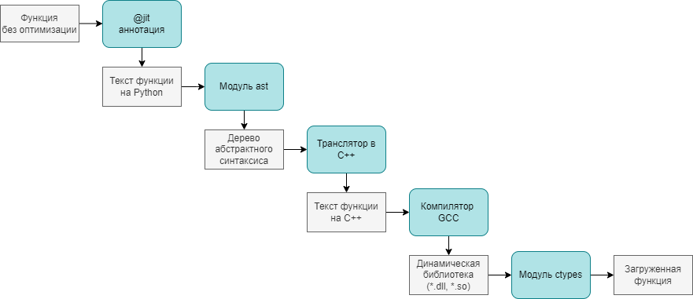
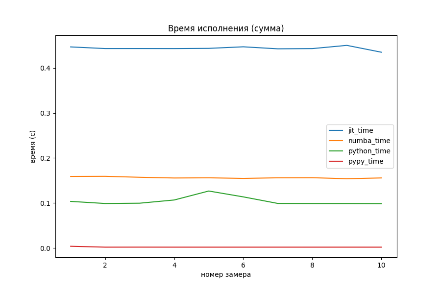
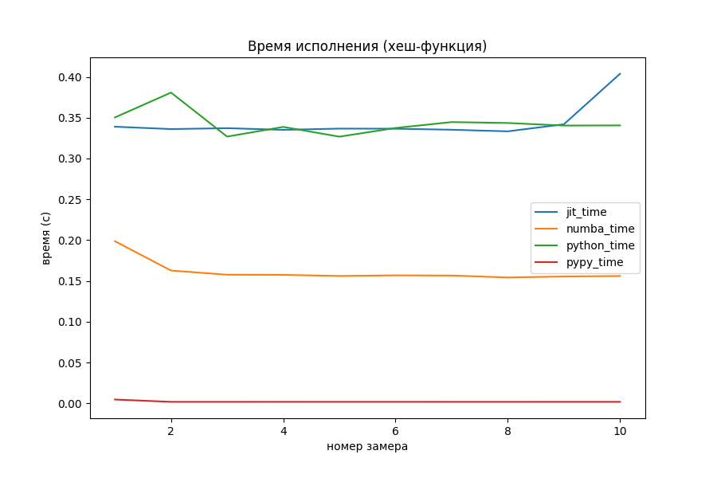
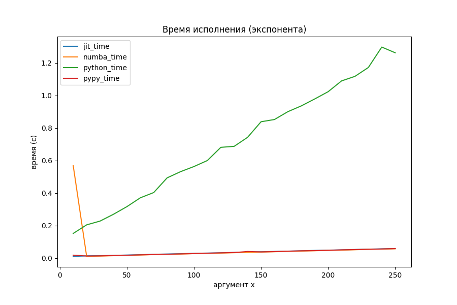
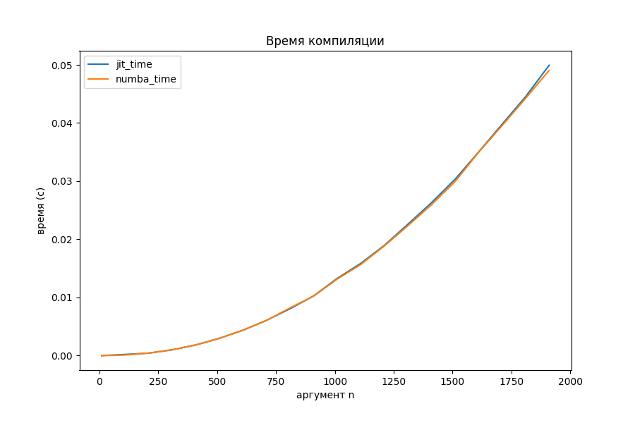
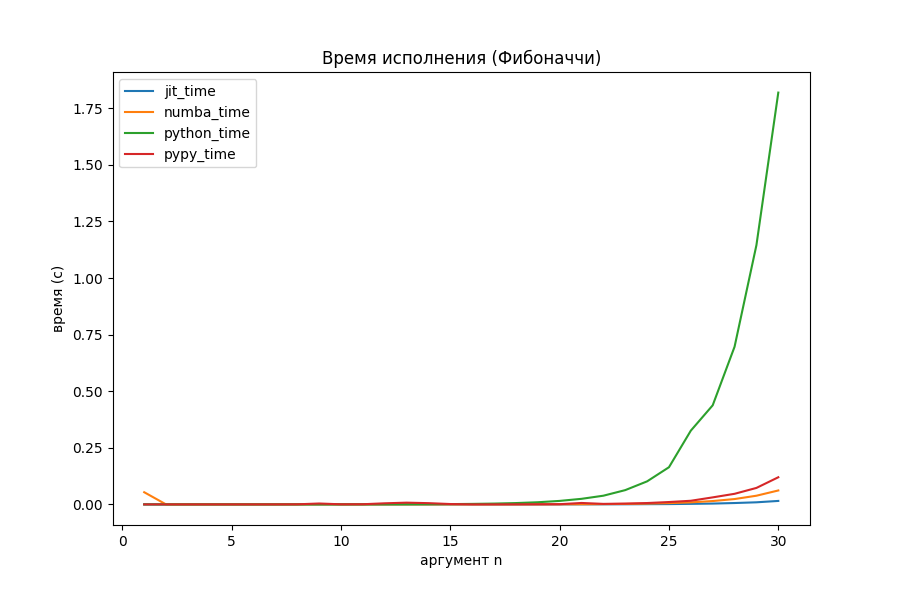
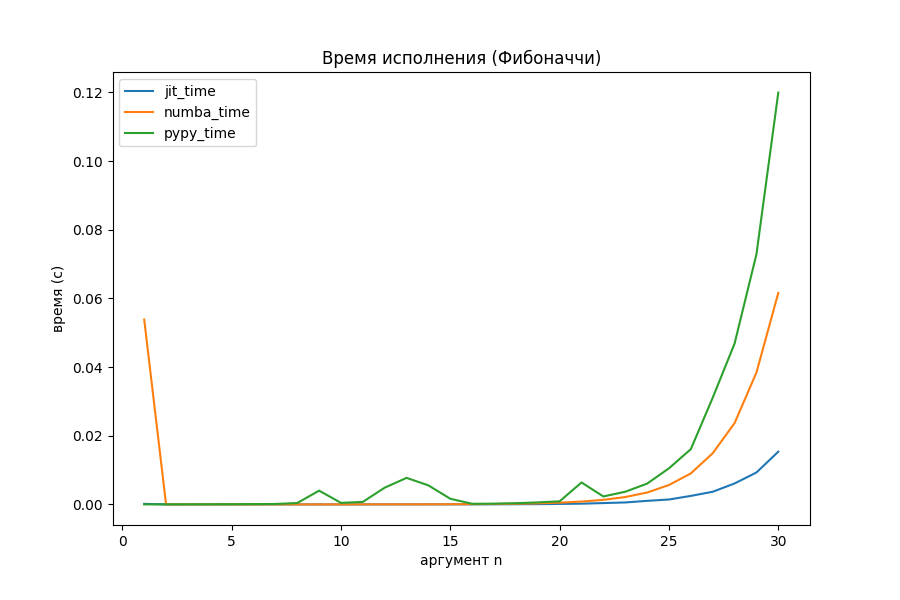

# JIT-компилятор Python в 300 строк

Может ли студент второго курса написать [JIT](https://en.wikipedia.org/wiki/Just-in-time_compilation) - компилятор Питона, конкурирующий по производительности с
промышленным решением? С учётом того, что он это сделает за две недели за зачёт по программированию.

Как оказалось, может.

## Предисловие

Обучаясь в РТУ МИРЭА, на специальности программная инженерия я попал на семестровый курс программирования на Питоне.
Питон я знал до этого, поэтому не хотелось много с ним возиться. Благо творчество студентов поощряется, иногда
даже "автоматами". Собственно, стимулируемый этим "автоматом" и тягой к написанию системных модулей
я написал JIT-компилятор, который назвал *MetaStruct*. 

Хочу сказать спасибо [Петру Николаевичу Советову](https://habr.com/ru/users/true-grue/) за наставничество при 
написании этого проекта и этой статьи. Как оказывается, писать статьи чуть ли не труднее, чем писать код в ящик.

С кодом проекта можно ознакомиться в [репозитории](https://github.com/PenzaStreetGames/MetaStruct.git).

[Предыдущий мой опыт](https://github.com/PenzaStreetGames/Yo.git) в написании низкоуровневых программ оказался 
нежизнеспособным и весьма поучительным. Но об этом сегодня речь не пойдёт.

Python - достаточно медленный язык. В сравнении с C++ называют замедление в
[20-30 раз](https://towardsdatascience.com/how-fast-is-c-compared-to-python-978f18f474c7). 
Но целое сообщество программистов на Питоне готовы заплатить эту цену ради удобства синтаксиса, быстроты
написания, изящности и выразительности кода.

На этой почве появляются разнообразные способы оптимизации выполнения программ на Питоне. 
Такие диалекты как [Cython](https://cython.org/), [RPython](https://rpython.readthedocs.io/en/latest/)
пытаются решить проблему "разгона" Питона за счёт статической типизации и компиляции модулей. 

В области JIT-компиляции промышленным решением является проект [Numba](https://numba.pydata.org/), спонсируемый
такими технологическими гигантами как Intel, AMD и NVIDIA. Именно с этим пакетом мне предложили и посоревноваться,
написав миниатюрный JIT-компилятор программ на Питоне.


В этой статье я хочу рассказать, с какими трудностями я, как программист достаточно прикладной, столкнулся
при написании такой довольно низкоуровневой вещи, как миниатюрный JIT-компилятор.

## Как оно работает



На схеме выше показано, какие этапы проходит функция на Питоне, становясь скомпилированным модулем на С++:

1. Функция, которую мы хотим оптимизировать, помечается аннотацией `@jit`, примерно так:
```python
@jit
def sum(x: int, y: int) -> int:
    res: int = x + y
    return res
```
2. Аннотация, получая объект функции, с помощью 
[`inspect.getsource(func_object)`](https://docs.python.org/3/library/inspect.html#inspect.getsource)
получает текст функции в виде строки.
3. С помощью функции 
[`ast.parse(func_py_text)`](https://docs.python.org/3/library/ast.html#ast.parse)
текст функции превращается в абстрактное синтаксическое дерево (AST) языка Питон
4. Моя программа проходится по дереву через метод `visit()`, наследуясь от 
[`ast.NodeVisitor`](https://docs.python.org/3/library/ast.html#ast.NodeVisitor),
и получает на выходе текст программы на C++, который записывается в файл. Для примера выше, он будет 
примерно таким:
```cpp
extern "C" int sum(int x, int y) {
    int res = (x + y);
    return res;
}
```
5. Через 
[`subprocess.run()`](https://docs.python.org/3/library/subprocess.html#subprocess.run)
происходит вызов компилятора [g++](https://gcc.gnu.org/releases.html), который выдаёт динамически подключаемую 
библиотеку (в зависимости от платформы файлом `.dll` или `.so`)
```shell
g++ -O2 -c source.cpp -o object.o
g++ -shared object.o -o lib.dll
```
6. При помощи вызова
[`ctypes.LibraryLoader(CDLL).LoadLibrary(dll_filename)`](https://docs.python.org/3/library/ctypes.html#loading-dynamic-link-libraries)
Динамическая библиотека подключается к среде выполнения и даёт доступ к скомпилированному варианту исходной функции.
7. Конечный пользователь, добавивший над функцией аннотацию `@jit`, пользуется совершенно другим 
вариантом своего кода, ничего не подозревая.

Процесс достаточно трудоёмкий для функции сложения из примера, но при частых вызовах и большом количестве вычислений 
внутри функции время компиляции окупается.

Если бы это был не Питон, а какой-нибудь предметно-ориентированный язык, то пришлось бы писать парсер и обход получившегося 
абстрактного дерева, и решение не было бы уже таким коротким. Но в моём случае, инфраструктура Питона и его гибкость 
сыграли мне на руку. 

## Впечатляющие результаты

Наверное, стоит от технической части переходить к части визуализации и маркетинга.

Созданный алгоритм JIT-компиляции был протестирован на нескольких простых алгоритмических задачах:

* Сумма двух чисел
* Хеш-функция для целых чисел
* Вычисление экспоненты через ряд Тейлора
* Числа Фибоначчи

С расчётами и графиками можно подробнее ознакомиться в 
[Jupyter-блокноте](https://github.com/PenzaStreetGames/MetaStruct/blob/main/performance.ipynb)

Для оценки времени выполнения использованы функции `timeit()` и `repeat()` модуля `timeit`.
Для отрисовки графиков - модуль `matplotlib` 

В примерах будут сравниваться три реализации функций:
* Просто функция питона
* Оптимизированных аннотацией `@jit`
* Оптимизированных аннотацией `@numba.jit`


### Сумма двух чисел



```python
def py_sum(x: int, y: int) -> int:
    res: int = x + y
    return res
```

На задаче сложения двух целых чисел никакой оптимизации не видно, даже наоборот. Накладные расходы на вызов 
функции из dll-файла и обработка результата занимает много времени по сравнению с самими расчётами. Numba обставила
моего "питомца" в 3 раза на этом примере.

### Хеш-функция для целых чисел



Обычно, для чисел из небольшого диапазона в качестве хеша используют их самих. Однако на просторах Интернета
я нашёл такую 
[хеш-функцию](https://qastack.ru/programming/664014/what-integer-hash-function-are-good-that-accepts-an-integer-hash-key):

```python
def py_hash(x: int) -> int:
    x = ((x >> 16) ^ x) * 0x45d9f3b
    x = ((x >> 16) ^ x) * 0x45d9f3b
    x = (x >> 16) ^ x
    return x
```

Автором сообщения утверждается, что значение параметра `0x45d9f3b` позволяет достичь наибольшей "случайности" бит внутри числа. По
крайней мере для хеш-функций такого вида.

Numba оказалась хорошо оптимизированной под битовые операции. Кажется, спонсорство главных производителей процессоров
и видеокарт не прошло даром. Мой же вариант оказался слегка быстрее простого Питона.

### Вычисление экспоненты через ряд Тейлора



Питон явно показал себя неважно, поэтому посмотрим на двух оптимизаторов отдельно.



Странное большое время для маленького x, выяснилось, обосновано тем, что Numba делает какие-то отложенные шаги
компиляции при первом запуске. На общей её производительности это почти никак не сказывается.

```python
def py_exp(x: float) -> float:
    res: float = 0
    threshold: float = 1e-30
    delta: float = 1
    elements: int = 0
    while delta > threshold:
        elements = elements + 1
        delta = delta * x / elements
    while elements >= 0:
        res += delta
        delta = delta * elements / x
        elements -= 1
    return res
```

Кому интересен матан, экспонента считается по формуле соответствующего ряда Тейлора:

$$e^x = \displaystyle\sum_{n=0}^\infty \frac{x^n}{n!}$$

Алгоритм прекращается, когда разница между дельтами двух итераций становится меньше порога, либо превращается в 
машинный ноль. Суммирование происходит от меньших членов к большим для уменьшения потерь точности.

Наконец-то моё творение начало соперничать с Numba. На больших объёмах вычислений однозначного лидера нет.

### Числа Фибоначчи



```python
def fib(n: int) -> int:
    if n < 2:
        return 1
    return fib(n - 1) + fib(n - 2)
```
Несмотря на то, что аннотация позволяет компилировать функции по одной, в ней всё ещё можно использовать рекурсию.

На рекурсии питон вообще перестал за себя отвечать. Что там с оптимизаторами?



Внезапно, реализованная в проекте компиляция начала работать в 4 раза быстрее, чем Numba.
Получается, что с задачами разветлённой рекурсии JIT-компилятор неплохо справляется.

Это одно из самых интересных мест всего исследования, которе можно было бы продолжить.

## Мысли сходятся

На самом деле, такой подход к оптимизации не нов в мире программирования. Чем-то похожим 
[занимался](https://vmakarov.fedorapeople.org/VMakarov-RubyKaigi2017.pdf) Владимир Макаров,
оптимизируя Ruby до уровня языка передачи регистров 
[RTL](https://en.wikipedia.org/wiki/Register_transfer_language) в своём проекте MJIT.

Существуют даже оптимизации сделанные поверх решения Макарова, о которых можно почитать 
[здесь](https://k0kubun.medium.com/the-method-jit-compiler-for-ruby-2-6-388ee0989c13).

В частности, исследованиях отмечается, что выбор компилятора, будь то GCC или LLVM, существенно не сказывается на 
производительности. В моём решении использован g++ из-за большей портируемости скомпилированного кода. 

Для ускорения вычислений в проекте Ruby используются также предскомплированные заголовки. Однако, для
студенческой работы такой уровень оптимизации не требуется.

## Непредвиденные трудности

Конечно же, всё заработало не с первого раза. Вероятно, даже не с десятого. Поэтому хотелось бы привести здесь 
небольшую "работу над ошибками"

### Типы данных

### Работа с DLL

### Простота кода

## Немного магии

## Итог